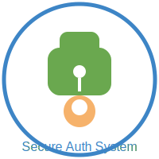

---

🛡️ User Authentication System
---

---
This is a Python-based User Authentication System that uses SQLite for database storage, SHA-256 hashing for password encryption, and regular expressions for validating email formats. This program allows users to:

Register a new account.

Log in to their account.

Log out after logging in.

Home Page Access for logged-in users only.

---

📋 Table of Contents

1. 📥 Installation

2. 📝 Features

3. 💻 How to Run

4. 🔑 How It Works

5. 🔨 Code Breakdown

6. 📌 Key Points

7. 🆘 Help Command

---

📥 Installation

To use this project, you'll need Python installed on your machine. Follow these steps:

1. Clone the repository:

git clone https://github.com/rkstudio585/user-auth-system.git

2. Navigate to the project directory:

cd user-auth-system

3. Install SQLite3 (if not installed): SQLite3 comes pre-installed with Python, but make sure it's available:

sqlite3 --version

4. Run the Python script:

python3 auth_system.py

---

📝 Features

Here’s what the program allows you to do:

1. 🔐 Register:

Create a new account by providing your name, email, and password (minimum 8 characters).

Email validation is performed using regex.

Passwords are hashed using SHA-256 for security.

User data is stored in an SQLite database.

2. 🔑 Login:

Log in using an existing account.

Validates the email and password from the SQLite database.

Redirects to a Home Page upon successful login.

3. 🚪 Logout:

After logging in, you can log out by confirming your password.

4. 🏠 Home Page:

Only available to logged-in users.

The only action available on this page is logging out or exiting.

5. 🆘 Help Menu:

A help command is available to explain how to use the system.

---

💻 How to Run

Here’s a step-by-step guide on how to run the system in your terminal.

1. Starting the Program:

Run the script:

python3 main.py

2. Available Commands: Once the program is running, you'll see a help menu with the following commands:

Type register to create a new account.

Type login to log into an existing account.

Type logout to log out from your account (only if logged in).

Type help to display the help menu.

Type exit to quit the program.

---

🔑 How It Works

This program has four core functionalities:

1. 🆕 Register:

The user provides their name, email, and password.

The email is validated using a regular expression to ensure it's in a valid format.

Passwords are hashed using the SHA-256 algorithm before being stored in the SQLite database.

2. 🗝️ Login:

The user provides their email and password to log in.

The system checks the email and hashed password against the stored credentials in the SQLite database.

Upon successful login, the user is redirected to their Home Page.

3. 🚪 Logout:

Once logged in, the user can choose to log out by confirming their password.

After logging out, they are returned to the main menu.

4. 🏠 Home Page:

When logged in, users access a Home Page with limited options (log out or exit).

This ensures they can’t register or log in again until they log out.

---

🔨 Code Breakdown

Here's an overview of the main components of the code:

Database Initialization (SQLite3):

Creates a users table if it doesn’t exist.

Stores the user's name, email, and hashed password.

Email Validation:

Uses the re library to validate email format.

Only valid emails (like name@example.com) are accepted.

Password Hashing (SHA-256):

Uses the hashlib library to hash passwords before storing them in the database.

This ensures password security by never storing plaintext passwords.

Registration:

Users are asked to provide their name, email, and password.

Data is validated, and the password is hashed and stored in the database.

Login:

Users provide their email and password.

The hashed password is compared with the stored hash in the database.

Home Page:

Once logged in, users are redirected to a simple home page with only the option to log out.

---

📌 Key Points

Here are some important things to know:

1. Minimum Password Length: Passwords must be at least 8 characters.

2. Email Format: Emails are validated using regular expressions, so they must follow the standard format (e.g., example@domain.com).

3. Hashed Passwords: For security, passwords are hashed using SHA-256 before being stored in the SQLite database.

4. Restricted Home Page: Only users who have successfully logged in can access the home page.

---

🆘 Help Command

The system comes with a built-in help menu. To access it at any time, simply type help and you'll see the following output:

--- Help Menu ---
Welcome to the User Management System!

You can perform the following actions:

1. Register - Create a new account.
2. Login - Log into your existing account.
3. Logout - Log out from your account (only available after logging in).

To use these actions, type one of the following commands:
- 'register' to create a new account.
- 'login' to log into your account.
- 'logout' (only available after login).
- 'help' to show this help message.
- 'exit' to quit the program.

---

✨ Conclusion

This User Authentication System is a basic yet secure solution for handling user registrations, logins, and session management. It’s a great starting point if you're building larger applications that require authentication.

If you need any help, feel free to check the help command or modify the code as needed!

Enjoy coding! 😎👨‍💻👩‍💻

---
